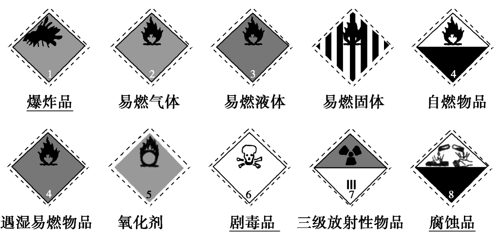

## §1 化学实验基本方法

### 概述

遵守实验室规则

取用药品“三不原则”：不能用手直接接触药品；不要把鼻孔凑到容器口去闻药品的气味；不得尝任何药品的味道

用剩的药品“三不原则”：不能放回原瓶；不要随意丢弃；不能拿出实验室

### 化学标志

### 药品的存放

广口瓶：固体药品

细口瓶：液体药品

棕色试剂瓶：见光易分解、易升华等

橡胶塞：碱性药品（液体）

玻利塞：酸性药品（液体）

软木塞（万能塞）：酸碱均可

煤油：活泼金属

### 药品的取用

#### 固体药品

粉末：药匙（纸槽），一斜二送三直立

块状固体：镊子，一横二放三慢滑

一定量：托盘天平

#### 液体药品

少量：胶头滴管，不横放、不平放、用后洗净

多量：用试剂瓶倾倒，标签朝手心

一定量：量筒（精度`0.1mL`）、滴定管

### 计量仪器

#### 托盘天平

调零，左物右码，一般固体放在纸上，腐蚀性药品（ $NaOH$ ） 放在玻璃器皿上，用镊子取砝码，精确度`0.1g`

#### 量筒

无零刻度，精确度`0.1mL`

#### 容量瓶

坑

#### 滴定管

坑

### 物质加热方法

#### 酒精灯

添加酒精时，酒精不超过容积的 $\frac{2}{3}$ ，不少于 $\frac{1}{3}$

绝对禁止向燃着的酒精灯里添加酒精，以免失火

绝对禁止用酒精灯引燃另一只酒精灯，要用火柴点燃　

用完酒精灯，必须用灯帽盖灭，不可用嘴去吹，要盖两次平衡气压

不要碰倒酒精灯，万一洒出的酒精在桌上燃烧起来，应立即用湿布或沙子扑盖

请勿将酒精灯的外焰受到侧风，一旦外焰进入灯内，将会爆炸

#### 仪器加热

先干燥仪器，先预热再局部加热，使用外焰加热

可直接加热的仪器：试管、坩埚、坩埚钳、蒸发皿、燃烧匙

需间接加热（隔网）的仪器：烧杯、烧瓶、锥形瓶

不能加热的仪器：量筒、容量瓶

### 其它

#### 仪器组装

从下到上，从左到右（拆的顺序与之相反）

#### 气体收集方法

排水集气法：适用于不溶于水、不与水反应的气体

向上（下）排空气法：适用于密度大（小）于空气的气体

